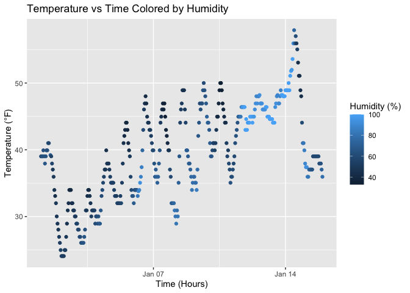

p8105_hw1_jw3638.Rmd
================
2025-09-19

## Problem 1:

\##Load libraries

``` r
library(tidyverse)
```

    ## ── Attaching core tidyverse packages ──────────────────────── tidyverse 2.0.0 ──
    ## ✔ dplyr     1.1.4     ✔ readr     2.1.5
    ## ✔ forcats   1.0.0     ✔ stringr   1.5.1
    ## ✔ ggplot2   3.5.2     ✔ tibble    3.3.0
    ## ✔ lubridate 1.9.4     ✔ tidyr     1.3.1
    ## ✔ purrr     1.1.0     
    ## ── Conflicts ────────────────────────────────────────── tidyverse_conflicts() ──
    ## ✖ dplyr::filter() masks stats::filter()
    ## ✖ dplyr::lag()    masks stats::lag()
    ## ℹ Use the conflicted package (<http://conflicted.r-lib.org/>) to force all conflicts to become errors

``` r
library(moderndive)
```

## Load dataset

``` r
data("early_january_weather")
```

The `early_january_weather` dataset contains: 358 rows and 15 columns of
hourly weather data collected at Newark Airport in January 2013. The
mean temperature during this time period was 39.6 °F.

The variables are: - `origin`: airport code (EWR)  
- `year`: year of observation  
- `month`: month of observation  
- `day`: day of month  
- `hour`: hour of day (0–23)  
- `time_hour`: date-time of the observation (`POSIXct`)  
- `temp`: temperature in °F  
- `dewp`: dew point in °F  
- `humid`: relative humidity (%)  
- `wind_dir`: wind direction (degrees from north)  
- `wind_speed`: wind speed (mph)  
- `wind_gust`: wind gust (mph)  
- `precip`: precipitation (inches)  
- `pressure`: air pressure (millibars)  
- `visib`: visibility (miles)

\##Making a scatterplot

``` r
weather_plot <- ggplot(early_january_weather, aes(x = time_hour, y = temp, color = humid)) +
  geom_point() +
  labs(
    title = "Temperature vs Time Colored by Humidity",
    x = "Time (Hours)",
    y = "Temperature (°F)",
    color = "Humidity (%)"
  )

weather_plot
```

<!-- -->

\##Plot analysis: Temperature changes in a repeating cycle-type pattern
across time with highs and lows across the days. There is a gradual
increase in overall temperatures across the x-axis (January). Humidity
(indicated with different shades of blue) kind of moves in the opposite
direction of temperature. Warmer conditions coordinate with less
humidity. Points group closely together and appear to be recorded at
consistent and regular intervals.

\##Export plot:

``` r
ggsave("weather_scatterplot.png")
```

    ## Saving 7 x 5 in image

\##Problem 2: step 1 –\> Create data frame

``` r
library(tidyverse)

## Set seed (for reproducibility)
set.seed(1234)

hw1_df <- tibble(
  vec_numeric = rnorm(10),                     
  vec_logical = vec_numeric > 0,                  
  vec_char = letters[1:10],                       
  vec_factor = factor(rep(c("low", "medium", "high"), length.out = 10)) 
)

hw1_df
```

    ## # A tibble: 10 × 4
    ##    vec_numeric vec_logical vec_char vec_factor
    ##          <dbl> <lgl>       <chr>    <fct>     
    ##  1      -1.21  FALSE       a        low       
    ##  2       0.277 TRUE        b        medium    
    ##  3       1.08  TRUE        c        high      
    ##  4      -2.35  FALSE       d        low       
    ##  5       0.429 TRUE        e        medium    
    ##  6       0.506 TRUE        f        high      
    ##  7      -0.575 FALSE       g        low       
    ##  8      -0.547 FALSE       h        medium    
    ##  9      -0.564 FALSE       i        high      
    ## 10      -0.890 FALSE       j        low

``` r
##Taking the mean of each variable
mean(pull(hw1_df, vec_numeric))
```

    ## [1] -0.3831574

``` r
mean(pull(hw1_df, vec_logical))
```

    ## [1] 0.4

``` r
mean(pull(hw1_df, vec_char))     
```

    ## Warning in mean.default(pull(hw1_df, vec_char)): argument is not numeric or
    ## logical: returning NA

    ## [1] NA

``` r
mean(pull(hw1_df, vec_factor))   
```

    ## Warning in mean.default(pull(hw1_df, vec_factor)): argument is not numeric or
    ## logical: returning NA

    ## [1] NA

\##convert variables to numeric using as.numeric

``` r
as_numeric_logical <- as.numeric(pull(hw1_df, vec_logical))
as_numeric_char <- as.numeric(pull(hw1_df, vec_char))
```

    ## Warning: NAs introduced by coercion

``` r
as_numeric_factor <- as.numeric(pull(hw1_df, vec_factor))
```

\##Mean results When using as.numeric(): Logical: TRUE becomes 1, FALSE
becomes 0 (works smoothly), but Character: can’t convert letters to
numbers, and Factor: converts to (1=low, 2=medium, 3=high)
